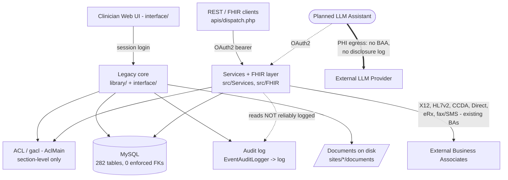

# OpenEMR Pre-Build Audit

**Scope:** full-system audit across Security, Performance, Architecture, Data Quality, and Compliance channels, run before building a **clinician-facing LLM assistant** that will read patient PHI from OpenEMR, summarize it, and send it to an external LLM provider. Findings are grounded in this repository's code (paths and line numbers verified). Method: evidence-gathering across all five channels followed by an adversarial re-check of the load-bearing citations.

**Codebase:** ~4,482 PHP files (excluding vendor), MySQL/MariaDB backend (282 tables, all InnoDB), PHP 8.2+, mixed legacy-procedural (`library/`, `interface/`) and modern PSR-4 (`src/`) code. Git `main`, "pruned base" import of OpenEMR master.

---

## Executive Summary

OpenEMR is a mature EMR, not a broken one: bound SQL parameters throughout (core injection risk is low), a real ACL system, at-rest encryption for documents and configurable columns, and existing audit-logging and disclosure machinery. The risk this audit surfaces is narrower — **three properties of the system become agent failure modes the moment an automated PHI reader is bolted on**, spanning the compliance, performance, and data-quality channels. That is the reason to audit before building.

**1. Nothing automatically logs or scopes PHI leaving the system — the control HIPAA requires for a new Business Associate.** Disclosure logging is wired only to a manual staff form (`recordDisclosure()`, called from one UI file, `disclosure_full.php:59`), never from an outbound path. No audit event means "record X was sent to the LLM"; read-auditing is a heuristic over SQL that silently drops SELECTs it can't classify (`EventAuditLogger.php:405`) and is disabled by one global. The audit log's tamper-resistance is an *unkeyed* SHA3 hash (`LogTablesSink.php:63`), forgeable by anyone with DB write. And an LLM provider becomes a Business Associate needing a BAA and minimum-necessary scoping — neither enforced (ACL is section-level, so one clinician token reads every patient). Close these **before** any PHI egress.

**2. Assembling a patient summary is slow by construction — a latency problem for a live agent.** OpenEMR's own full-chart path (CCDA export) runs an estimated ~110–160 *serial* DB round-trips per patient, dominated by N+1 loops. FHIR/REST searches have **no default row cap** (`QueryPagination::DEFAULT_LIMIT = 0`) and several resources ignore `_count`, so "all labs" streams the full history into memory. Every request also re-reads the ~600-row `globals` table and runs ~2 uncached JOIN-heavy ACL queries per check. Reused verbatim, these paths make the assistant sluggish and hard to scale.

**3. Data integrity is convention-only, so an automated summarizer will confidently produce wrong or incomplete summaries.** 282 tables define **zero enforced foreign keys** (the schema's only `FOREIGN KEY` matches are column comments, not constraints), so orphaned clinical rows join to nothing and vanish from a summary silently. Duplicate patients are created freely (dedup is an advisory score, not a constraint), so the agent summarizes half a chart. Demographics use empty-string sentinels (`NOT NULL default ''`), making "absent" and "blank" indistinguishable; invalid dates collapse to `0000-00-00` and render as real dates; diagnoses/meds/labs are free text with only optional codes; and the problem/allergy read path doesn't filter inactive rows, so resolved conditions surface as current.

**Security** is otherwise broadly sound but has specific holes worth fixing regardless: reflective CORS that echoes any Origin with credentials (`CORSListener.php:57`), a reversed auth-skip check (`SkipAuthorizationStrategy.php:57`), a session cookie with `HttpOnly` disabled (`SessionConfigurationBuilder.php:88`), and the REST dispatcher returning raw exception messages (`dispatch.php:42`).

**Bottom line:** buildable, but not safely on the system as-is. Close the compliance egress-control gaps first (disclosure logging, BAA gate, minimum-necessary scoping, tamper-evident audit), then build a purpose-scoped read path that batches queries and caps result sets, and treat every field as untrusted before it reaches the model. Findings: 44 — 4 Critical, 19 High, 17 Medium, 4 Low, counting conditional escalations at base severity (Security 9 · Performance 11 · Data Quality 13 · Compliance 11); per-channel detail below, each with a verified citation, and sequencing in §6.

---

## 1. Architecture Map

### 1.1 Entry points

| Entry point | Handler | Auth model |
|---|---|---|
| Clinician web UI | `interface/**` bootstrapped by `interface/globals.php` | PHP session; login via `library/auth.inc.php` → `AuthUtils` |
| REST + FHIR API | `apis/dispatch.php` → `_rest_routes.inc.php` → route tables in `apis/routes/` | OAuth2 / OpenID Connect bearer tokens (`src/Common/Auth/OpenIDConnect`) |
| Patient portal | `portal/**` | Separate portal session (`SessionConfigurationBuilder::forPortal`) |
| CLI / background | `bin/`, `src/Console`, `contrib/util/**` | Runs as server user; no HTTP auth |
| Cron / scheduled jobs | `src/BackgroundServices`, `interface/main/daemons` | Server-side |

### 1.2 Components (with responsibility and location)

- **Legacy procedural core** (`library/`, `interface/`) — page controllers, form rendering, and most write paths (e.g. `library/patient.inc.php` owns demographic writes). Uses `$GLOBALS`/`$_SESSION` as a service locator.
- **Modern service layer** (`src/Services/*Service.php`) — PSR-4 `OpenEMR\` domain services extending `BaseService`; the API/FHIR read/write logic (`PatientService`, `EncounterService`, `ConditionService`, `ProcedureService`, …).
- **FHIR layer** (`src/FHIR`, `src/Services/FHIR`) — maps OpenEMR records to FHIR R4/US-Core resources; fan-out services (`FhirObservationService` registers ~10 sub-services).
- **REST controllers** (`src/RestControllers`) — thin controllers behind the dispatcher; authorization via `RestControllerHelper` + `AclMain`.
- **Auth & ACL** (`src/Common/Auth/OpenIDConnect`, `src/Gacl`, `src/Common/Acl/AclMain.php`) — OAuth2 server and the gacl-based access-control catalog (section/category grants).
- **Audit logging** (`src/Common/Logging/EventAuditLogger.php`, `src/Common/Logging/Audit/LogTablesSink.php`) — writes the `log` and `extended_log` tables; optional ATNA/syslog sink.
- **Data access** (`library/sql.inc.php` legacy `sqlStatement`/`sqlQuery`, `src/Common/Database`, `QueryUtils`) — ADODB-surface API over Doctrine DBAL to MySQL.
- **Crypto** (`src/Common/Crypto/CryptoGen`) — AES-256, dual key sets for DB-column and on-drive document encryption.
- **Existing outbound integrations** — mostly under `interface/modules/custom_modules/` (Weno eRx, DORN labs, EtherFax/Clickatell fax-SMS) plus `library/direct_message_check.inc.php` (Direct) and X12/EDI billing.

### 1.3 Layering and boundaries

Intended layering is transport (`interface/`, `apis/`) → domain (`src/Services`) → data (`QueryUtils`/DBAL) → MySQL. In practice the boundary is **already blurred**: legacy `interface/`+`library/` code reaches directly into SQL and `$GLOBALS`, bypassing the service layer, and the *same table is written by two different paths with different validation* (e.g. `PatientService::insert()` runs `PatientValidator`, but the legacy demographics UI calls `updatePatientData()` → direct DB insert with no validator — see DQ-9). New capabilities should sit on the `src/Services` side; that layer is the only one with consistent typing and validation.

### 1.4 Primary data-flow paths (traced)

- **Web chart load:** `interface/globals.php` sets `$_SESSION['pid']` from `$_GET['pid']`/`$_POST['pid']` (`globals.php:771-773`), then page code pulls the record via legacy SQL. Authorization is a **section-level** ACL check (`patients/demo`, `patients/med`, …), not per-record — any user holding the section grant can load any `pid`.
- **API/FHIR read (the path the assistant will use):** `dispatch.php` → OAuth2 token validation → route → `RestController` → `Service::search()` → `QueryUtils` → MySQL, mapped to FHIR. Pagination is requested via `_count`; see PERF-2/PERF-3 for why it often does not take effect.
- **Full-chart assembly (closest existing analog to the assistant):** the CCDA exporter `interface/modules/zend_modules/module/Carecoordination/**/EncounterccdadispatchTable.php` gathers demographics + every clinical section for one patient — the N+1-heavy path quantified in PERF-1.

### 1.5 Where state lives

- **MySQL** — system of record for all structured PHI (282 tables, all InnoDB; `patient_data`, `forms`/`form_*`, `lists`, `prescriptions`, `procedure_*`, `billing`, `log`).
- **Filesystem** — patient documents under `sites/<site>/documents/` (encrypted when `drive_encryption` on); `sites/<site>/` also holds per-site config.
- **`globals` table** — runtime configuration (~600 rows), rebuilt into `$GLOBALS` every request.
- **Sessions** — PHP files by default, optionally Redis (`src/Common/Session/Predis`).

### 1.6 Integration points (existing outbound PHI = existing Business-Associate relationships)

| Integration | Direction | Data crossing |
|---|---|---|
| Weno eRx (`oe-module-weno`) | outbound | Demographics + vitals to `online.wenoexchange.com` |
| Direct / phiMail (`direct_message_check.inc.php`) | in/out | Clinical documents (CCDA) |
| DORN labs (`oe-module-dorn`) | outbound | Full HL7v2 lab orders |
| EtherFax / Clickatell (`oe-module-faxsms`) | outbound | Document images, SMS |
| X12 / EDI clearinghouse | outbound | Claims (billing PHI) |
| Telemetry (`src/Telemetry`) | outbound | Aggregate usage + server geolocation (no per-patient PHI observed) |
| **Planned LLM assistant** | **outbound** | **PHI charts — no BAA, no disclosure log, no minimum-necessary scoping yet** |

### 1.7 Component & egress diagram



### 1.8 The assistant's read path — where the gaps line up

```mermaid
sequenceDiagram
    participant A as LLM Assistant
    participant API as FHIR/REST (dispatch.php)
    participant ACL as AclMain (section-level)
    participant SVC as Services / FHIR
    participant DB as MySQL
    A->>API: GET /fhir/... patient=X (bearer token)
    API->>ACL: aclCheckCore(section) - 2 uncached JOIN queries
    API->>SVC: search() - _count often ignored, no default cap
    loop per clinical row (N+1)
        SVC->>DB: author / facility / specimen lookup
    end
    SVC-->>A: full history (unbounded); inactive rows unfiltered
    Note over A,DB: No audit event "PHI sent to LLM"; no disclosure record
```

### 1.9 Build / run / deploy shape

Docker-based dev stack (`docker/development-easy`, `openemr-cmd`), Webpack 5 + SASS front-end build, PHPUnit/Jest tests, PHPStan level 10. A `Dockerfile` + `railway.json` were added for Railway deployment (single-container app + MySQL). Deployment boundary: one app container fronting one MySQL instance and a local documents volume — relevant to the horizontal-scaling limits in PERF.

### 1.10 Open architectural unknowns

- Whether the target deployment terminates TLS at a proxy and how `X-Forwarded-Proto` is handled (affects real cookie `Secure` behavior).
- Whether Redis session storage and Gacl caching are enabled in production (affects PERF-4/PERF-5).
- Which `custom_modules` are actually enabled (affects which outbound BA integrations and which PHI-logging paths are live).

## 2. Security

Findings follow the schema: Severity · Location · Evidence · Impact · Recommendation · Confidence. Citations verified by reading the cited code. Note on scope: this is a static read; runtime-config-dependent items are flagged.

### SEC-1 · Core session cookie has HttpOnly (and Secure) disabled
- **Severity:** High
- **Location:** `src/Common/Session/SessionConfigurationBuilder.php:88` (`forCore`), base default `:26`
- **Evidence:** `forCore()` explicitly calls `->setCookieHttpOnly(false)` and never sets `cookie_secure` (base default `'cookie_secure' => false`). By contrast `forOAuth`/`forApi` call `setCookieSecure(true)`. So the primary `OpenEMR` clinician session cookie is `HttpOnly=false, Secure=false` (SameSite is `Strict` by base default, which mitigates CSRF but not token theft).
- **Impact:** Any XSS in the EMR UI can read `document.cookie` and exfiltrate an authenticated clinician session (full PHI access); without `Secure`, the cookie can leak over an HTTP downgrade/mixed-content path. `HttpOnly` is a baseline control for a PHI web app.
- **Recommendation:** Set `cookie_httponly=true` for the core session and `cookie_secure=true` gated on HTTPS. If a legacy JS reason for `httponly=false` exists, document and scope it.
- **Confidence:** High (runtime `Secure` also depends on proxy TLS handling).

### SEC-2 · Reflective CORS with credentials allows any origin against the API
- **Severity:** High
- **Location:** `src/RestControllers/Subscriber/CORSListener.php:57` and `:67`
- **Evidence:** The response echoes the caller's Origin verbatim — `$response->headers->set("Access-Control-Allow-Origin", $origins[0]);` — while the preflight sets `'Access-Control-Allow-Credentials' => 'true'`. No allow-list; an in-code `@TODO: review security implications` concedes the looseness.
- **Impact:** A malicious site a logged-in user visits can make credentialed cross-origin calls to the REST/FHIR API and read JSON PHI responses. The assistant's new endpoints inherit this open policy.
- **Recommendation:** Replace origin reflection with a configured allow-list (registered OAuth client origins); reflect only listed origins, otherwise omit the header. Reconsider `Allow-Credentials: true` for public clients.
- **Confidence:** High.

### SEC-3 · Auth-skip route match uses reversed `str_starts_with` (prefix-confusion / latent auth bypass)
- **Severity:** Medium (High if the skip-list grows)
- **Location:** `src/RestControllers/Authorization/SkipAuthorizationStrategy.php:57`
- **Evidence:** Arguments are transposed — `if (str_starts_with($route, $pathInfo))` tests whether the *configured skip route* starts with the *request path*, not the reverse. When matched, `authorizeRequest` sets `skipAuthorization=true` and defaults the role to `system`. Skip routes include `/fhir/metadata`, `/api/version`, etc.; with the reversal, a request path that is a *prefix* of a skip route (e.g. `/api`) matches.
- **Impact:** Today most colliding prefixes likely 404, limiting exploitability, but this is a live auth-bypass primitive precisely as new endpoints are added — any future skip route whose prefix collides with a real PHI endpoint becomes unauthenticated.
- **Recommendation:** Fix to `str_starts_with($pathInfo, $route)` (consider exact-match for metadata/well-known routes) and add a regression test that non-skip routes are not matched.
- **Confidence:** High that the bug is real (verified); runtime reach is the uncertain part.

### SEC-4 · REST/FHIR dispatcher returns raw exception message to clients
- **Severity:** Medium
- **Location:** `apis/dispatch.php:42`
- **Evidence:** Top-level catch does `die(json_encode([... 'message' => $e->getMessage()]))` for the entire API surface.
- **Impact:** Uncaught exceptions leak internal detail (SQL fragments, file paths, class names) to any API caller — reconnaissance aid; violates the project's own standard ("never expose `$e->getMessage()` in user-facing output"). The assistant's endpoints route through this handler.
- **Recommendation:** Return a generic message + correlation id; log the real message/trace server-side only.
- **Confidence:** High.

### SEC-5 · OAuth client secrets stored reversibly-encrypted, not hashed
- **Severity:** Medium
- **Location:** `src/Common/Auth/OpenIDConnect/Repositories/ClientRepository.php:93` (store), `:200-207` (validate)
- **Evidence:** Store: `encryptForDatabase(...)`; validate: `decryptFromDatabase(...)` then `hash_equals($clientSecret, $secret)`. The compare is constant-time (good), but secrets are recoverable plaintext given the DB + crypto keys.
- **Impact:** A key+DB compromise yields every confidential client's secret, including the assistant's OAuth client secret → attacker can mint tokens. One-way hashing would prevent this.
- **Recommendation:** Store confidential-client secrets with `password_hash`/argon2id and verify with `password_verify`.
- **Confidence:** High.

### SEC-6 · Coarse (section-level) authorization — no per-record/object-level scoping for clinician tokens
- **Severity:** Medium (High for the assistant use case)
- **Location:** `src/Common/Acl/AclMain.php:166` (`aclCheckCore`); enforcement e.g. `apis/routes/_rest_routes_standard.inc.php:511`
- **Evidence:** ACL checks are section/category grants (`patients/docs`, `patients/med`, …). A `users`-role token holding the section can request any `{pid}`; handlers pass the caller-supplied pid through. Within a resource the service does bind id→pid (e.g. `DocumentService.php:164` `WHERE id=? AND foreign_id=?`), and patient-role FHIR tokens *are* record-scoped (`FhirGenericRestController.php:94`). But clinician tokens have no facility/care-team/panel constraint.
- **Impact:** One compromised or over-broadly scoped clinician token can bulk-read the entire patient population and stream it to the LLM. There is no blast-radius limit on the automated reader.
- **Recommendation:** For the assistant, mint narrowly-scoped tokens (SMART patient-launch / `patient/*`) bound to the patient in context; consider a facility/care-team-scoped repository for new endpoints. Do not rely on section ACLs alone.
- **Confidence:** High (behavior verified; "acceptable vs not" is a policy call for this use case).

### SEC-7 · PHI written to server logs in fax/SMS module paths
- **Severity:** Medium
- **Location:** `interface/modules/custom_modules/oe-module-faxsms/src/Controller/FaxDocumentService.php:114,223,472`
- **Evidence:** `error_log("... for patient {$patientId}")` interpolates patient identifiers directly into PHP error logs (core code is generally better — e.g. `QrdaReportService.php:136` routes pid through `errorLogEscape`/`xlt`).
- **Impact:** Patient IDs (and by join, PHI) land in plaintext logs not treated as a PHI store — a HIPAA logging concern, and the exact anti-pattern the assistant's "which patient went to the LLM" logging must avoid.
- **Recommendation:** Route through PSR-3 with context arrays and scrub identifiers; set a no-raw-PHI logging convention now. (Confirm whether these modules are enabled in your deployment.)
- **Confidence:** High.

### SEC-8 · `display_errors` can be toggled on via a UI global on a PHI system
- **Severity:** Low
- **Location:** `interface/globals.php:796-833` (`user_php_debug` switch)
- **Evidence:** When `user_php_debug` is 2/3/4, code calls `ini_set('display_errors','1')`. Off by default (respects php.ini) but a one-setting flip in the admin UI.
- **Impact:** If enabled in production, PHP warnings/fatals render into HTML/API responses leaking paths/SQL/stack context (compounds SEC-4).
- **Recommendation:** Hard-gate `display_errors=1` behind `OPENEMR__ENVIRONMENT === 'dev'`; never allow in production regardless of `user_php_debug`.
- **Confidence:** High.

### SEC-9 · Committed private keys in Docker fixtures (dev-only)
- **Severity:** Low
- **Location:** `docker/library/couchdb-config-ssl-cert-keys/**`, `docker/library/sql-ssl-certs-keys/**` (`*-key.pem`)
- **Evidence:** `BEGIN … PRIVATE KEY` files committed for the local dev stack. No secrets found in `sites/`, `.env*`, or application source.
- **Impact:** Development-only TLS material; risk only if the "easy"/"insane" stacks are reused as-is in a reachable environment.
- **Recommendation:** Keep as labeled dev fixtures; ensure production compose generates fresh keys; add a CI check that prod overlays never reference them.
- **Confidence:** High.

**Areas checked and found solid:** No direct interpolation of `$_GET/$_POST/$_REQUEST` into query strings in `library/`, `interface/`, `src/` — data access consistently uses `?` binds (**SQL-injection risk in core is low**). Web-reachable `exec`/`proc_open`/`system` sinks wrap values in `escapeshellarg`/`escapeshellcmd`. 96 of 97 standard API routes carry an explicit ACL check (the exceptions `/api/version`, `/api/product` are intentionally public). At-rest encryption defaults on (`database_encryption`, `drive_encryption` = `'1'`), AES-256, but is column/document-selective, not whole-DB.

**Security blind spots:** real cookie `Secure`/`SameSite` behavior depends on the deployed proxy; CORS exploitability depends on whether a fronting proxy strips/overrides headers; SEC-3's real reach needs the live router; effective per-user ACL grants live in `gacl_*` DB tables (runtime); whether PHI is minimized before LLM egress cannot be assessed because that code does not exist yet.

## 3. Performance

These findings determine the assistant's response latency and scale. Query-count totals are static inferences from reading the code (no load test was run); each names the profiling that would confirm it. "One query per result row → a 500-row list = 500 queries" is the reasoning style throughout.

### PERF-1 · Full patient-summary assembly ≈ 110–160 serial DB round-trips (per-encounter and per-record N+1)
- **Severity:** Critical
- **Location:** `interface/modules/zend_modules/module/Carecoordination/src/Carecoordination/Model/EncounterccdadispatchTable.php:2224-2250` (`getEncounterHistory`), per-record author lookup `:3449` (`getDetails`)
- **Evidence:** The CCDA exporter — OpenEMR's existing "assemble everything for one patient" path — fetches all encounters in one query, then loops issuing `fetchRecords($query_procedures, ...)` and `fetchRecords($issue_q, ...)` per encounter (`1 + 2E` queries; E=20 → 41). Separately, every clinical list row (allergy, med, problem, result, vital) calls `getAuthorXmlForRecord()` → `getDetails($author_id)`, one single-row lookup **per record** that a single `WHERE id IN (...)` would collapse. Realistic patient ≈ 110–160 queries.
- **Impact:** Reproducing a faithful full summary costs ~110–160 serial round-trips *before the first token reaches the LLM*. At 1–2 ms/query warm-local that is 100–300 ms of pure query latency; on a networked DB or under load, far worse, growing linearly with encounter/list size.
- **Recommendation:** Do not reuse the CCDA gatherer verbatim. Batch the per-encounter queries with `WHERE encounter IN (...)` and resolve all `author_id`s in one `IN (...)`. Confirm with the MySQL general query log around one export.
- **Confidence:** High for the paths; Medium for the count (static inference).

### PERF-2 · FHIR/REST searches have NO default row cap — a missing `_count` streams every matching row
- **Severity:** Critical
- **Location:** `src/Common/Database/QueryPagination.php:20` (`DEFAULT_LIMIT = 0`), `:45` (`min($limit, MAX_LIMIT)`); `src/Services/Search/SearchConfigClauseBuilder.php:56`
- **Evidence:** `DEFAULT_LIMIT = 0`; `MAX_LIMIT = 200` is only a ceiling on a *requested* size (`min` clamps down only); the clause builder emits a `LIMIT` **only if `$limit > 0`**. With `_count` absent, no `LIMIT` is emitted. An in-code TODO confirms the intent ("let ALL data be retrieved with 0").
- **Impact:** A single "all labs / all encounters" call on a long-history patient returns the entire result set in one query and one in-memory PHP array — latency and memory spikes with no server-side backstop.
- **Recommendation:** Give `QueryPagination` a non-zero default (e.g. 100) and a hard server cap independent of requested `_count`. Confirm by issuing a `_count`-less FHIR search and inspecting the SQL.
- **Confidence:** High.

### PERF-3 · Most FHIR resources ignore `_count` entirely — pagination never reaches SQL
- **Severity:** High
- **Location:** `src/Services/FHIR/FhirServiceBase.php:313-316`; `src/Services/FHIR/FhirEncounterService.php:314-317`
- **Evidence:** The base `searchForOpenEMRRecordsWithConfig()` discards `$searchConfig` and calls `searchForOpenEMRRecords()` with no limit. Only overriders honor `_count` (`FhirPatientService` does; Encounter/Allergy/Medication/Lab do not — `EncounterService::search`'s `$options['limit']` is never populated).
- **Impact:** Compounds PERF-2 — even a well-behaved assistant sending `_count=50` gets full history for these resources; latency scales with total history, not page size.
- **Recommendation:** Thread `$searchConfig` through the base method and each underlying `search()`'s `limit`. Verify with `_count=5` returning >5 rows.
- **Confidence:** High.

### PERF-4 · Entire `globals` table (~600 rows) read and rebuilt into `$GLOBALS` on every request
- **Severity:** High
- **Location:** `interface/globals.php:450-454`
- **Evidence:** `sqlStatementNoLog("SELECT gl_name, gl_index, gl_value FROM globals ORDER BY ...")` then a row-by-row `while` hydrate, with no cache layer; `globals.php` is included by essentially every entry point (web, API, FHIR), and a comment notes it deliberately re-reads rather than caching in session.
- **Impact:** A fixed per-request tax (~600 rows fetched + looped) on 100% of assistant calls before any patient data is touched; multiplies under concurrency.
- **Recommendation:** Cache the globals set (APCu/Redis) keyed by site, invalidated on `edit_globals.php` save. Confirm by timing the include in isolation.
- **Confidence:** High for path; Medium for magnitude.

### PERF-5 · ACL checks hit the DB twice per call (recursive super-check) with gacl caching off by default
- **Severity:** High
- **Location:** `src/Common/Acl/AclMain.php:174` (recursive `admin/super` check), `:180` (`acl_query`); `src/Gacl/Gacl.php:68` (`$_caching = FALSE`), `:343-369` (multi-JOIN)
- **Evidence:** Every `aclCheckCore` first recurses to test `admin/super` (one full `acl_query`) then runs the real check — ~2 queries, each a 5–7 table LEFT JOIN, with gacl caching defaulting off.
- **Impact:** Authorization overhead scales with the number of distinct ACL checks per request; an assistant authorizing several PHI categories multiplies JOIN-heavy queries on top of data queries.
- **Recommendation:** Enable gacl query caching (exists via `Cache_Lite`) with invalidation on ACL edits, and/or memoize the `admin/super` result once per request. Confirm ACL query volume with the query log during a summary load.
- **Confidence:** High for the pattern; Medium for per-request count (workload-dependent).

### PERF-6 · `parseVitalsIntoObservationRecords` runs one `uuid_mapping` query per vitals row (N+1)
- **Severity:** High
- **Location:** `src/Services/FHIR/Observation/FhirObservationVitalsService.php:448-451, 524-526, 599-601`
- **Evidence:** The search loop calls `getVitalSignsUuidMappings` per row → `UuidMapping::getMappedRecordsForTableUUID($uuid)` = `SELECT ... FROM uuid_mapping WHERE target_uuid = ?` for each vitals encounter.
- **Impact:** `GET /fhir/Observation?category=vital-signs` issues one extra mapping lookup per encounter — proportional to visit history, and it runs inside the Observation fan-out (PERF-8), so it compounds.
- **Recommendation:** Batch into a single `WHERE target_uuid IN (...)` before the loop. Confirm on a 20+ vitals-encounter patient.
- **Confidence:** High.

### PERF-7 · DiagnosticReport/lab assembly issues ~2 queries per report (N+1)
- **Severity:** High
- **Location:** `src/Services/ProcedureService.php:475-505`
- **Evidence:** A post-search loop runs `sqlQuery("SELECT procedure_order_id ...")` (`:478`, re-fetching a value already available) and `sqlStatement("... FROM procedure_specimen ...")` (`:505`) per report — ~2R queries for R reports.
- **Impact:** Lab-heavy patients add ~2 queries per report to any lab retrieval; the assistant's "pull all labs" scales with report count.
- **Recommendation:** Replace with a single JOIN or `WHERE procedure_report_id IN (...)`. Confirm on a lab-heavy patient.
- **Confidence:** High.

### PERF-8 · FHIR Observation fan-out runs ~10 sub-service searches per request
- **Severity:** High
- **Location:** `src/Services/FHIR/FhirObservationService.php:64-73, 151`; `src/Services/FHIR/Traits/MappedServiceTrait.php:66-79`
- **Evidence:** The constructor registers ~10 mapped Observation sub-services (vitals, labs, social history, …); `searchServices` invokes `getAll()` on each. An unfiltered `GET /fhir/Observation?patient=X` executes ~10 full searches, several carrying their own N+1s (PERF-6, PERF-7) and none applying `_count` (PERF-3).
- **Impact:** One of the heaviest single endpoints the assistant could hit — effectively ~10 searches plus per-row N+1s, uncapped.
- **Recommendation:** Always send `category=` so only the relevant sub-service runs; server-side, short-circuit fan-out by requested category. Confirm breadth with the query log.
- **Confidence:** High.

### PERF-9 · MedicationRequest / Provenance issue one `facility` query per returned resource (N+1)
- **Severity:** Medium
- **Location:** `src/Services/FHIR/FhirMedicationRequestService.php:407-408, 453-454` → `FacilityService.php:103`; provenance `FhirServiceBase.php:274-286` → `FhirProvenanceService.php:123-124`
- **Evidence:** Per medication row, `populateReported`/`populateRequestor` call `getPrimaryBusinessEntityReference()` → `FacilityService::search()` = one `facility` query per row; with `_revinclude=Provenance:target` each record re-queries the primary org and doubles the resource count.
- **Impact:** A 200-row medication Bundle ≈ 200 extra `facility` queries (400 resources + ~200 more with provenance). The value is constant per request — pure waste.
- **Recommendation:** Resolve the primary-organization reference once per request and inject it. Confirm by counting `facility` queries with/without provenance.
- **Confidence:** High.

### PERF-10 · `patient_data.*` over-fetch: ~132-column wide row pulled in full on every patient read
- **Severity:** Medium
- **Location:** `src/Services/PatientService.php:426-438` (`SELECT patient_data.*`); schema `sql/database.sql` (~132 cols); `BaseService::getSelectFields()` returns all columns
- **Evidence:** `search()` selects the entire wide row (incl. `occupation` longtext, guardian block, `usertext1..8`/`userlist1..7`, `care_team_*` TEXT) when a header needs ~10 fields. `SELECT *` is the default across services (`form_encounter` ~35 cols, `prescriptions` ~49 cols read per-encounter/med).
- **Impact:** Every patient lookup ships ~132 columns and several TEXT blobs into PHP when ~10 are used; compounds across a multi-encounter summary.
- **Recommendation:** Add explicit projections (a lean `getSummaryFields()`) for summary assembly. Confirm bytes/row and time vs `SELECT *`.
- **Confidence:** High for width; Medium for wire/latency cost.

### PERF-11 · `PatientService::search` runs 3 queries with 3 correlated LEFT JOINs even for a single-patient fetch
- **Severity:** Medium
- **Location:** `src/Services/PatientService.php:418-523` (`search`, called by `getOne` `:646`)
- **Evidence:** Every patient fetch issues COUNT + UUID-list + data query, and the data query LEFT JOINs three derived subqueries (`patient_history`, `users`, a 3-table contact/address JOIN). An in-code comment explains the deliberate double-search to assemble name history + addresses.
- **Impact:** A trivial "get one patient" is 3 round-trips over a multi-join query, not a single `WHERE uuid = ?` — front-loaded before section retrieval begins.
- **Recommendation:** Use a lean projected lookup (`findByPid`-style) for the summary header; fetch name-history/extra-addresses only when needed. Confirm with the query log on one `getOne`.
- **Confidence:** High.

**Performance positives:** schema is **100% InnoDB** (0 MyISAM), so the classic table-lock concern does not apply; primary `pid`/`patient_id`/`uuid` filters on the main hot tables are indexed; and core/API sessions default to **read-and-close** (`SessionConfigurationBuilder::forCore($readOnly=true)` + `ReadAndCloseNativeSessionStorage`), largely mitigating the PHP session-write-lock serialization for read paths.

**Performance blind spots:** no measured latency — confirm every count with `SET GLOBAL general_log=ON` around a real summary/`$everything` sweep and a request-scoped counter; warm-local (~0.1–1 ms/query) vs cold/networked (5–20 ms) turns the same count into very different wall-clock; profile against the largest real charts where N+1 hurts most. Unindexed columns to watch if the assistant queries them: `drug_sales.pid`, `billing.encounter`, `patient_data.pubpid`, `audit_master.pid`. Whether Redis sessions / gacl caching are enabled is deployment config.

## 4. Data Quality

Each finding cites the schema fact and the code path that exploits it, plus the profiling query that would quantify it against real data. The headline structural fact: **282 tables (all InnoDB) define zero enforced FOREIGN KEY constraints** — the only four case-insensitive matches for `FOREIGN KEY` in `sql/database.sql` are column `COMMENT 'Foreign key to …'` annotations on the `form_clinical_notes` link tables (documentation, not constraints), and no `REFERENCES` clause exists anywhere. Referential integrity across the entire clinical dataset is convention-only.

### DQ-1 · Empty-string sentinels make "absent" and "known-blank" indistinguishable
- **Severity:** High
- **Location:** schema `sql/database.sql` (patient_data, ~47 cols `varchar(255) NOT NULL default ''`, e.g. `race`, `sex`, `ss`, `phone_home`); write path `library/patient.inc.php:1118-1129` (`pdValueOrNull`)
- **Evidence:** The write path converts empties to `NULL` only for a hardcoded date whitelist (`DOB`, `regdate`, `contrastart`, `userdate*`, `deceased_date`); every other empty value is stored as `''`.
- **Impact:** The agent cannot tell "no recorded race" from "unknown/not asked" — both are `''`. `WHERE race IS NULL` never matches; a summarizer may drop a field that should be flagged missing, or hallucinate-fill it.
- **Recommendation:** Treat `''` as NULL at the read boundary for patient_data varchars before feeding the model. Profiling: `SELECT COUNT(*) FROM patient_data WHERE race=''` (repeat per demographic column).
- **Confidence:** High.

### DQ-2 · `fixDate()` writes the `0000-00-00` sentinel; display code slices it into a fake date
- **Severity:** High
- **Location:** write default `library/global_functions.inc.php:274` (`fixDate($date, $default="0000-00-00")`); blind display `src/Services/Utils/DateFormatterUtils.php:188-215`
- **Evidence:** On parse failure `fixDate` returns `"0000-00-00"`, not NULL. The formatter does no validity check — it substring-slices, so `"0000-00-00"` renders as `"00/00/0000"`. 37 occurrences of the literal `0000-00-00` across 24 PHP files; `sanitize.inc.php:177-186` shows the code expects both NULL and `'0000-00-00'` in date columns.
- **Impact:** A `begdate`/`start_date`/`filled_date` of `0000-00-00` fed to the agent renders as a real-looking date or crashes a strict `DateTime` parser. "When did this medication start?" may be answered with a garbage date stated as fact.
- **Recommendation:** At agent ingress, map `'0000-00-00'`, `'0000-00-00 00:00:00'`, and `'1970-01-01 00:00:00'` to null. Profiling: `SELECT COUNT(*) FROM lists WHERE begdate='0000-00-00' OR enddate='0000-00-00'` (and prescriptions/procedure_result date columns).
- **Confidence:** High.

### DQ-3 · Duplicate patients can be created freely; dedup is an advisory score, not a constraint
- **Severity:** High
- **Location:** PID gen `src/Services/PatientService.php:151-157` (`getFreshPid` = `SELECT MAX(pid)+1`); validator `src/Validators/PatientValidator.php:56-59` (no dedup); post-hoc score `library/patient.inc.php:1675-1688`, `library/dupscore.inc.php:18-40`
- **Evidence:** New PIDs come from an unlocked read-modify-write (`SELECT MAX(pid)+1` — verified); the only insert validations are presence + length (no name+DOB uniqueness). Schema has `UNIQUE KEY pid`/`uuid` but **no** unique key on `(lname,fname,DOB)`. Dedup runs *after* insert and merely writes a `dupscore`.
- **Impact:** The most dangerous silent failure for a summarizer: two records for one person split problems/meds/labs across two PIDs; summarizing PID=A omits everything on PID=B and confidently presents an incomplete picture. Concurrent imports can even collide on the same PID.
- **Recommendation:** Feed `dupscore` to the agent as a quality flag and warn when high; add a real match gate at ingress. Profiling: `SELECT lname,fname,DOB,COUNT(*) c FROM patient_data GROUP BY lname,fname,DOB HAVING c>1` and `SELECT COUNT(*) FROM patient_data WHERE dupscore>20`.
- **Confidence:** High.

### DQ-4 · `users.username` has no UNIQUE constraint — provider/author attribution is unreliable
- **Severity:** Medium
- **Location:** schema `sql/database.sql` (`users.username varchar(255) default NULL`, no unique key); join-by-username `src/Services/ConditionService.php:71-78`
- **Evidence:** Clinical records join back to their author by username string (`lists.user`), not id; `users.username` is nullable with no uniqueness.
- **Impact:** Duplicate/reused/renamed usernames resolve a diagnosis to the wrong clinician or to none — the agent misattributes or omits provenance.
- **Recommendation:** Attribute via `users.id`/`uuid`, never `lists.user`. Profiling: `SELECT username,COUNT(*) c FROM users WHERE username IS NOT NULL GROUP BY username HAVING c>1`.
- **Confidence:** High.

### DQ-5 · Problems/allergies/meds share `lists` with a nullable `activity` flag; the FHIR read path doesn't filter inactive rows
- **Severity:** High
- **Location:** schema `lists.activity tinyint(4) default NULL`; read path `src/Services/ConditionService.php:44-92`
- **Evidence:** The active/resolved discriminator is nullable; the Condition query filters only on `type='medical_problem'` — no `activity=1` clause, so every matching row returns. Other code (`LayoutsUtils.php:19`) *does* gate on `activity=1` — inconsistent.
- **Impact:** The agent receives resolved/inactive problems mixed with active and may summarize a cured condition as current; allergies (same table) can present an inactivated allergy as active.
- **Recommendation:** Always pass clinical status through and default naive summaries to `activity=1`. Profiling: `SELECT type,activity,COUNT(*) FROM lists GROUP BY type,activity`.
- **Confidence:** High.

### DQ-6 · Coded clinical data (diagnoses, meds, labs) stored as free text, codes optional
- **Severity:** High
- **Location:** `lists.diagnosis varchar(255)`, `prescriptions.drug varchar(150)` + `rxnorm_drugcode varchar(25) NULL`, `procedure_result.result varchar(255)` + `result_data_type char(1) DEFAULT 'S'`; parse `src/Services/ConditionService.php:104-105`
- **Evidence:** Problem codes live in a free-text varchar parsed into `SYSTEM:code` at read time; meds store a free-text name with an *optional* RxNorm code; lab results collapse numeric and string values into one text column with a type discriminator; units/range are free text. No `CHECK` constraints exist anywhere.
- **Impact:** An uncoded/malformed `diagnosis` gives the agent a bare label with no ICD/SNOMED anchor (misclassification); a med with no `rxnorm_drugcode` can't be reconciled for interactions; `result='<0.5'`/`'POSITIVE'` in a column assumed numeric breaks threshold logic; `"mg/dL"` vs `"mg/dl"` defeats reference-range comparison.
- **Recommendation:** Parse `result_data_type` before interpreting `result`; expose code-presence as a quality flag. Profiling: `SELECT COUNT(*) FROM prescriptions WHERE (rxnorm_drugcode IS NULL OR rxnorm_drugcode='') AND drug IS NOT NULL`.
- **Confidence:** High.

### DQ-7 · Enumerated demographics fall back to the raw code when the list option is missing/deactivated
- **Severity:** Medium
- **Location:** schema (`sex`/`race`/`ethnicity`/`status` varchars holding `list_options.option_id`); resolver `src/Common/Layouts/LayoutsUtils.php:17-24`
- **Evidence:** Resolution queries `list_options ... AND activity=1`; if empty it returns the raw `option_id`. `list_options` is a generic free-text KV table.
- **Impact:** If a site deactivates/renames an option or a value predates the current list, the agent sees a raw token like `"amer_ind"` or legacy `"1"` and may mislabel/hallucinate an expansion; arbitrary/misspelled values also pass straight through.
- **Recommendation:** Resolve codes server-side for the agent; mark unresolved ones "unknown code." Profiling: left-join patient_data demographics to `list_options` and count unresolved.
- **Confidence:** High.

### DQ-8 · Referential integrity is convention-only: PHI child tables have no FK to patient_data
- **Severity:** High
- **Location:** whole schema — 0 enforced FKs (the only `FOREIGN KEY` text matches are column comments in the `form_clinical_notes` link tables); unenforced PID columns e.g. `forms.pid`, `lists.pid`, `form_encounter.pid`, `prescriptions.patient_id`, `procedure_report`/`procedure_result` chain; `form_encounter.provider_id INT DEFAULT '0'`, `forms.provider_id ... default 0`
- **Evidence:** case-sensitive `grep -c "FOREIGN KEY" sql/database.sql` = **0**; the 4 case-insensitive matches are column `COMMENT 'Foreign key to …'` strings, and no `REFERENCES` clause exists anywhere in the schema (verified both ways — an earlier draft miscounted the comment matches as constraints; the corrected number makes the finding stronger). Every clinical child table carries `pid`/`patient_id` as a plain indexed column with no constraint; `0` is used as a "no provider" sentinel that is not a valid `users.id`.
- **Impact:** Orphan rows are possible at the storage layer — a `lists`/`prescriptions`/`procedure_result` row whose `pid` points to a deleted/nonexistent patient won't error, and won't join, so it silently vanishes from a per-patient summary with no signal that data was lost. Conversely a med written with `patient_id=0`/NULL is missed by "all meds for PID=X."
- **Recommendation:** Run orphan-detection before trusting any per-patient rollup. Profiling: `SELECT COUNT(*) FROM lists l LEFT JOIN patient_data p ON l.pid=p.pid WHERE p.pid IS NULL` (repeat for forms/prescriptions/form_encounter/procedure_result); `SELECT COUNT(*) FROM form_encounter WHERE provider_id=0`.
- **Confidence:** High.

### DQ-9 · Server-side validation is thin and inconsistent between the API and the legacy UI save path
- **Severity:** Medium
- **Location:** API validator `src/Validators/PatientValidator.php:48-106`; legacy UI path `library/patient.inc.php:1144-1164` (no validator)
- **Evidence:** `PatientValidator` (API/service ingress) enforces only fname/lname/sex/DOB presence, sex length 4–30, email format. The legacy `updatePatientData()` used by the demographics UI calls `databaseInsert`/`databaseUpdate` directly, bypassing `PatientService::insert()` (the only method that runs the validator). The two write paths for the same table enforce different rules; the sex length rule (4–30) even rejects `M`/`F`.
- **Impact:** UI-entered data can violate assumptions the API guarantees; an agent that trusts "the API validated this" is wrong for records entered via the legacy path (the majority).
- **Recommendation:** Route all writes through `PatientService`, or replicate validation in the legacy path; do not assume any stored field is schema-valid. Profiling: `SELECT sex,COUNT(*) FROM patient_data GROUP BY sex`; `SELECT COUNT(*) FROM patient_data WHERE DOB IS NULL`.
- **Confidence:** Medium (legacy path confirmed to skip validator; not all UI callers exhaustively traced).

### DQ-10 · Deceased status is inferred solely from a nullable date — no boolean flag
- **Severity:** Medium
- **Location:** schema `patient_data.deceased_date datetime default NULL`, `deceased_reason varchar(255) NOT NULL default ''`
- **Evidence:** No `is_deceased` boolean. "Alive" and "death date unknown/unrecorded" are both `deceased_date IS NULL`.
- **Impact:** A patient who died but whose date was never entered reads as living — an LLM opening "Living 72-year-old…" for a deceased patient is a severe, clinically embarrassing failure.
- **Recommendation:** Surface deceased status as a tri-state (deceased/alive/unknown); never infer "alive" from NULL alone. Profiling: `SELECT COUNT(*) FROM patient_data WHERE deceased_date IS NOT NULL`; cross-check `deceased_reason<>''` with no date.
- **Confidence:** High.

### DQ-11 · UUIDs are nullable and backfilled lazily
- **Severity:** Medium
- **Location:** schema (`uuid binary(16) DEFAULT NULL` across clinical tables, `UNIQUE KEY uuid` permits multiple NULLs); `src/Common/Uuid/UuidRegistry.php`; `library/patient.inc.php:1109-1113`
- **Evidence:** Legacy patient insert assigns a UUID *after* the row exists and only if empty; `UuidRegistry` provides bulk "populate missing UUIDs" routines — UUID assignment is a batch backfill, not a NOT NULL guarantee.
- **Impact:** A FHIR/agent pipeline keyed on `uuid` misses rows whose UUID hasn't been backfilled (NULL) — silent under-reporting.
- **Recommendation:** Verify UUID backfill has run before agent reads; treat NULL uuid as "not yet exportable." Profiling: `SELECT COUNT(*) FROM patient_data WHERE uuid IS NULL` (repeat per clinical table).
- **Confidence:** Medium.

### DQ-12 · Denormalized title/code copies can silently disagree with their source
- **Severity:** Medium
- **Location:** schema `prescriptions.usage_category` + `usage_category_title`, `request_intent` + `request_intent_title`; `lists_medication` mirrors these; `forms.form_name longtext`
- **Evidence:** Both a code and a frozen human title are stored; the titles are snapshots not updated when the corresponding `list_options.title` is edited; `lists_medication` duplicates the columns.
- **Impact:** The agent may read a stale title that no longer matches the resolved code, or two records for the same code showing different titles — contradictions it can't reconcile.
- **Recommendation:** Prefer resolving codes live via `list_options`; if using the snapshot, flag divergence. Profiling: join prescriptions to `list_options` and count `*_title <> title`.
- **Confidence:** Medium.

### DQ-13 · `NOT NULL` date columns with no default accept `0000-00-00` under legacy `sql_mode`
- **Severity:** Medium
- **Location:** schema `prescriptions.txDate DATE NOT NULL`, `drug_sales.sale_date date NOT NULL` (no default)
- **Evidence:** Declared `NOT NULL` with no default; the pervasive `fixDate()`→`'0000-00-00'` machinery only makes sense if zero-dates are insertable (i.e. `NO_ZERO_DATE`/STRICT not set). An INSERT omitting the column stores `0000-00-00`.
- **Impact:** `NOT NULL` gives false confidence in "always present"; the agent gets the zero sentinel and hits the same fake-date/crash failure as DQ-2 on a column the schema advertises as reliable.
- **Recommendation:** Don't treat `NOT NULL` dates as valid; apply the zero-date scrub. Verify live `SELECT @@sql_mode`. Profiling: `SELECT COUNT(*) FROM prescriptions WHERE txDate='0000-00-00'`.
- **Confidence:** Medium (depends on deployment `sql_mode`).

**Data-quality blind spots:** all of the above are structural certainties; the *prevalence* of each (zero-date counts, duplicate-patient rate, empty-vs-missing ratio, orphan-row counts, NULL-UUID backlog, enum-drift spread) can only be measured with the profiling queries against real data. Confirm the live `sql_mode` — it determines whether DQ-13 zero-dates keep accruing.

## 5. Compliance & Regulatory (HIPAA)

**Regime:** HIPAA — Security Rule (§164.312 technical safeguards incl. audit controls §164.312(b)), Privacy Rule (minimum-necessary §164.502(b)/§164.514(d); accounting of disclosures §164.528), Breach Notification Rule. Driving change: sending PHI to an external LLM provider makes that provider a **Business Associate**, requiring a signed BAA, minimum-necessary data, and a disclosure/audit trail. Findings are compliance-reviewer gaps grounded in code; obligations that live in contracts/policy outside the repo are marked **needs-verification**. The four load-bearing gaps for this feature are CMP-1, CMP-2, CMP-3, and CMP-6.

### CMP-1 · No automated disclosure / accounting-of-disclosures hook for the planned LLM egress
- **Severity:** Critical
- **Location:** `src/Common/Logging/EventAuditLogger.php:567` (`recordDisclosure`); sole caller `interface/patient_file/summary/disclosure_full.php:59`; table `extended_log`
- **Evidence:** Disclosures are recorded only through a manual, user-initiated form — `recordDisclosure()` is invoked from exactly one UI file (verified by repo-wide grep), never from an outbound-integration path. No existing external transfer (X12, Weno, DORN, fax, Direct) auto-writes a disclosure record either.
- **Impact:** §164.528. When the assistant transmits PHI to the LLM (a disclosure to a BA), **nothing in the codebase creates a disclosure record** unless the new feature explicitly writes one on every send — so the practice cannot produce an accounting of what PHI went to the LLM, for which patient, when. A breach-investigation blind spot.
- **Recommendation:** Build a non-bypassable egress log into the LLM client: write an `extended_log`/disclosure row (patient_id, recipient, fields sent, timestamp, requesting user) *before* the network call; reconcile on response.
- **Confidence:** High (code-grounded); the org's accounting-of-disclosures policy is needs-verification.

### CMP-2 · No first-class "PHI sent to LLM" audit event; read-auditing is SQL-heuristic and drops what it can't classify
- **Severity:** Critical
- **Location:** `src/Common/Logging/EventAuditLogger.php:405` (`auditSQLEvent`), `:440`, `:501-505`
- **Evidence:** The only mechanism capturing PHI *reads* is heuristic interception of SELECTs, gated on `audit_events_query`, that `return`s early (silently drops) SELECTs it can't map to a known table. The event taxonomy has no "disclosure"/"external-transfer" category.
- **Impact:** §164.312(b). An assistant that reads a chart via the service/FHIR layer, aggregates in PHP, and POSTs it out produces (at best) generic `select` rows and **zero** records tying those reads to an outbound disclosure — the audit log cannot answer "was this patient's data sent to the LLM, and exactly what?"
- **Recommendation:** Add a dedicated audit event (e.g. `newEvent('llm-disclosure', …)`) emitted on every egress capturing the exact scope; make it immune to the `audit_events_*` toggles (like the existing breakglass exception).
- **Confidence:** High.

### CMP-3 · Audit log is not tamper-resistant — checksum is an unkeyed hash
- **Severity:** High
- **Location:** `src/Common/Logging/Audit/LogTablesSink.php:63` (`hash('sha3-512', implode('', array_values($logData)))`), `:89` (`'encrypt' => 'No'`), `:55` (`'crt_user' => ''`); report `interface/reports/audit_log_tamper_report.php:249`
- **Evidence:** The "tamper" checksum is a plain SHA3-512 over the row's own values with **no HMAC/secret key** (verified); the report recomputes the same unkeyed hash and compares. Log row and checksum live in the same InnoDB DB, written over the same connection; the ATNA `crt_user` identity is hard-coded empty.
- **Impact:** §164.312(b)/(c)(1). Anyone with DB write (rogue DBA, compromised app credential, SQL injection) can edit a log entry and recompute a valid checksum — the report shows no discrepancy. The system detects accidental corruption, not deliberate tampering, undermining the log's evidentiary value exactly when the LLM feature raises disclosure stakes.
- **Recommendation:** Replace with an HMAC keyed by a secret held outside the app DB, and/or hash-chain each entry to its predecessor, and/or ship to append-only external storage (the ATNA/syslog sink is the natural anchor).
- **Confidence:** High.

### CMP-4 · Query/PHI-read auditing can be globally disabled; off-box tamper-evident sink is off by default
- **Severity:** High
- **Location:** `library/globals.inc.php:2778` (`enable_auditlog`), `:2832` (`audit_events_query`), `:2785` (`audit_events_patient-record`), `:2858` (`enable_atna_audit`); enforced `EventAuditLogger.php:410,440,516`
- **Evidence:** Defaults are reasonable (`enable_auditlog`, `audit_events_patient-record`, `audit_events_query` = `'1'`), but all are admin-editable booleans the logger honors as hard gates; a single toggle stops PHI-read logging site-wide (except breakglass). `enable_atna_audit` defaults `'0'`, so the only off-box sink is off by default.
- **Impact:** §164.312(b). Read-side audit coverage is a runtime setting an administrator can silently switch off; there is no enforced floor.
- **Recommendation:** Make LLM-disclosure logging (CMP-1/2) independent of these toggles; add a deployment-hardening check that flags when audit globals are off; enable ATNA/syslog for off-box retention.
- **Confidence:** High for defaults/behavior; a given deployment's actual settings are needs-verification.

### CMP-5 · Audit `log.comments` stores raw SQL with bound values — PHI lands in the audit table in the clear
- **Severity:** High
- **Location:** `EventAuditLogger.php:446-452,660-664`; `LogTablesSink.php:89` (`encrypt='No'`); schema `log.comments longtext`
- **Evidence:** For SQL events the statement plus bound parameter values become the comment, then are only base64-encoded (an in-code note says the encryption path "was removed"). `deleter.php:76` serializes entire row contents into a comment. `log_comment_encrypt.encrypt` is hard-set `'No'`.
- **Impact:** §164.312(a)(2)(iv)/(e)(2)(ii). The audit trail becomes a secondary, unencrypted PHI store (SSNs, DOBs, note text) — expanding breach surface. If the LLM feature logs its prompts here, it writes PHI-heavy payloads in the clear.
- **Recommendation:** For LLM events, log field *names/scope*, not raw PHI values; if payloads must be retained, restore an encryption path and set `encrypt='Yes'`.
- **Confidence:** High.

### CMP-6 · New LLM egress = unmet BAA + minimum-necessary obligation; existing integrations show the established BA pattern
- **Severity:** High
- **Location:** Weno `oe-module-weno/src/Services/WenoValidate.php:217`; Direct `library/direct_message_check.inc.php:104,128`; DORN `oe-module-dorn/src/ConnectorApi.php:104`; EtherFax `oe-module-faxsms/src/EtherFax/EtherFaxClient.php:20,254`; Clickatell `.../ClickatellSMSClient.php:48`
- **Evidence:** OpenEMR already transmits rich PHI to multiple external parties, each an implicit BA (Weno sends demographics+vitals; DORN base64-wraps a full HL7 order; EtherFax POSTs document images). These establish the BAA-gated pattern the LLM feature must follow — but the LLM provider is a **new** BA with no BAA, no minimum-necessary scoping, and (per CMP-1) no disclosure log.
- **Impact:** §164.502(e)/§164.308(b) (BAA required before disclosure to a BA) + §164.502(b) (minimum-necessary). Sending PHI to an LLM API without an executed BAA is a violation; sending whole charts (CMP-7) violates minimum-necessary.
- **Recommendation:** Execute a BAA before enabling egress (needs-verification, contractual); gate the feature behind a config flag that stays off until a BAA attestation is recorded; scope payloads to minimum-necessary; model the client on an existing BA integration but add the disclosure log the others lack.
- **Confidence:** High for the egress pattern; BAA existence is needs-verification.

### CMP-7 · No minimum-necessary enforcement on bulk reads; ACL is section-level, not field/purpose-scoped
- **Severity:** High
- **Location:** `src/Common/Acl/AclMain.php:36-52` (section "patients": `demo`, `med`, `notes`, `rx`, `lab`, …)
- **Evidence:** Access control is coarse: a user with `patients/med` reads the entire medical record; there is no field-level gate and nothing limiting how much of a chart a workflow pulls. (Ties to SEC-6.)
- **Impact:** §164.502(b)/§164.514(d). An assistant that reads "the whole chart" to answer a narrow question exports far more PHI than necessary to the external provider — the core minimum-necessary tension of this feature — with no existing control constraining it.
- **Recommendation:** Introduce purpose-scoped extraction (select only task-relevant fields/sections, redact identifiers not needed), a dedicated "LLM assistant" ACL grantable/revocable independently, and log the scope (CMP-1).
- **Confidence:** High (ACL model code-grounded; minimum-necessary adequacy is a policy judgment).

### CMP-8 · SSN stored unencrypted in `patient_data.ss`
- **Severity:** Medium
- **Location:** schema `patient_data.ss varchar(255) NOT NULL default ''`; read `library/patient.inc.php:951-955` (`getPatientSSN`, `ss LIKE ?`); contrast document encryption `library/classes/Document.class.php:992`
- **Evidence:** SSN is a plain varchar, queried/written as cleartext (no `encryptStandard`). Documents, by contrast, are encrypted when `drive_encryption` on (default). Column-level at-rest encryption is inconsistent and depends on `database_encryption` covering the DB host, not the field.
- **Impact:** §164.312(a)(2)(iv). If the DB or a backup is exposed, SSNs are directly readable; relevant if the assistant or its logs ever touch SSN.
- **Recommendation:** Encrypt SSN at the application layer (`CryptoGen`) or guarantee disk/DB encryption; never include SSN in LLM payloads or audit comments. Confirm `database_encryption` posture (needs-verification).
- **Confidence:** High that the column is plaintext in schema/queries; volume-level encryption is deployment-dependent.

### CMP-9 · Patient deletion leaves orphaned document files on disk; no enforced retention floor
- **Severity:** Medium
- **Location:** `interface/patient_file/deleter.php:185-190` (`delete_document` flips `deleted=1`, leaves file), `:246-252` (cascade), `:219` (`aclCheckCore('admin','super')`); `library/globals.inc.php:1071` (`allow_pat_delete` default `'0'`)
- **Evidence:** Patient delete cascades and logs each row, but document deletion only flips a DB flag — an in-code comment says the file is deliberately kept "for ONC certification." No code enforces a retention *period* (grep finds no retention/purge policy engine).
- **Impact:** Two-sided: orphaned PHI files persist after a patient is "deleted" (breach surface; complicates a right-to-delete request), and the ~6-year HIPAA retention expectation is left entirely to operators. Note: deleting a patient will not retract anything already sent to the LLM provider.
- **Recommendation:** Decide document-file lifecycle explicitly and document it; add retention enforcement or operator guidance; ensure LLM disclosure records survive patient deletion for accounting.
- **Confidence:** High on code behavior; retention-policy adequacy is needs-verification.

### CMP-10 · Telemetry / geolocation phones home by default (aggregate only)
- **Severity:** Low
- **Location:** `src/Telemetry/TelemetryService.php:57-70,171,202-209`; `src/Telemetry/GeoTelemetry.php`; `src/Services/ProductRegistrationService.php:121`
- **Evidence:** Telemetry sends site UUID + aggregate usage/population counts + server geolocation to `reg.open-emr.org`; no per-patient PHI observed in the read code. Server IP is sent to third-party geo APIs (ipapi.co, geoplugin.net, ip-api.com, ipify.org).
- **Impact:** Low direct HIPAA exposure, but it shows the app already makes unattested outbound third-party calls without BAAs — a governance pattern to tighten before the higher-risk LLM egress.
- **Recommendation:** Confirm telemetry never includes PHI; inventory all outbound third-party calls and bring them under the same BAA/opt-in governance as the LLM feature.
- **Confidence:** Medium-High (aggregate-only from read code; full payload over time is needs-verification).

### CMP-11 · License is GPLv3 — copyleft attaches to an in-tree assistant module
- **Severity:** Low (informational)
- **Location:** `LICENSE:1-2`; `composer.json` (`"license": "GPL-3.0-or-later"`)
- **Evidence:** Confirmed GPLv3; every source header carries GPL 3.
- **Impact:** Not HIPAA. If the assistant is a derivative work (an in-tree module linking OpenEMR PHP, like the existing BA integrations) and is distributed, GPLv3 requires its source be released under GPLv3. A purely external service the app calls over HTTP is generally not a derivative work.
- **Recommendation:** If shipping as an OpenEMR module, plan GPLv3-compatible licensing; if external, keep the integration boundary at the network layer. Confirm the derivative-work line with counsel (needs-verification).
- **Confidence:** High on the license; derivative-work analysis is legal.

**Compliance blind spots / needs-verification (outside the repo):** existence/terms of a BAA with the LLM provider and with existing BAs (Weno, EtherFax, Clickatell, DORN, phiMail, geo APIs); the deployed audit config (whether the good defaults were left on, whether ATNA is enabled); at-rest encryption posture of the DB volume/backups; the org's retention & deletion policy and Notice of Privacy Practices; the actual telemetry payload from a production site.

## 6. Planning Synthesis — building the clinician-facing assistant

This section turns the findings into decisions. It is organized as: hard blockers to close before any PHI egress, design constraints the assistant must respect, a recommended build sequence, and the unknowns to resolve first.

### 6.1 Hard blockers — close before any PHI leaves for the LLM

These are compliance-driven and non-negotiable for a lawful launch:

1. **Execute a BAA with the LLM provider** and gate the entire feature behind a config flag that stays off until a BAA attestation is recorded (CMP-6). Contractual — start now, it has the longest lead time.
2. **Build a non-bypassable disclosure log + audit event** into the LLM client: every egress writes an `extended_log` disclosure row and a dedicated `llm-disclosure` audit event capturing patient, requesting user, field scope, and timestamp — independent of the `audit_events_*` toggles (CMP-1, CMP-2, CMP-4).
3. **Enforce minimum-necessary by construction:** the assistant reads a purpose-scoped projection, not the whole chart, and redacts identifiers it doesn't need (CMP-7, SEC-6). Do not send SSN (CMP-8).
4. **Make the audit trail tamper-evident** (HMAC or hash-chain, plus the ATNA/syslog off-box sink) before it becomes the record of PHI disclosures (CMP-3), and never log raw PHI payloads in `log.comments` (CMP-5, SEC-7).

### 6.2 Design constraints the assistant must respect

**Performance — do not reuse the existing chart-assembly path.** The CCDA gatherer and the FHIR read layer are N+1-heavy and uncapped (PERF-1, 2, 3, 6, 7, 8). A naive "pull the whole FHIR chart" assistant will issue well over a hundred serial queries and can stream an entire patient history into memory. Build a dedicated, batched summary reader: one query per section with `WHERE … IN (...)`, resolve authors/facilities once per request, and impose a hard row cap regardless of `_count`. Budget for the fixed per-request taxes (globals reload PERF-4, ~2 uncached ACL JOINs per check PERF-5) — cache both. Confirm the real numbers with the query log before committing to a synchronous request/response UX; if a full summary is inherently >1–2 s, design for async/streaming.

**Data quality — treat every field as untrusted at the read boundary.** The assistant is an automated consumer, and this data was curated for human tolerance. Before any value reaches the model: normalize `''` and `0000-00-00`/`1970-01-01` to explicit "missing" (DQ-1, 2, 13); check `dupscore` and warn on likely-split charts (DQ-3); filter to `activity=1` for problems/allergies unless status is explicitly carried (DQ-5); resolve codes and flag uncoded diagnoses/meds/labs (DQ-6, 7); parse `result_data_type` before treating a lab result as numeric (DQ-6); attribute via `users.id`, not username (DQ-4); surface deceased status as a tri-state (DQ-10); skip NULL-UUID rows knowingly (DQ-11); and run the orphan-detection queries (DQ-8) so silently-dropped rows are known, not invisible. A short "data completeness / caveats" preamble the model must honor will prevent confident hallucination over gaps.

**Security — inherit the API surface deliberately.** New endpoints ride the existing dispatcher and inherit its reflective CORS (SEC-2), raw-exception responses (SEC-4), and the reversed auth-skip check (SEC-3). Fix those in the dispatcher, or the assistant's endpoints ship with them. Mint the assistant a narrowly-scoped OAuth client (SMART `patient/*` bound to the patient in context), not a broad clinician `users` token (SEC-6), and store its client secret hashed (SEC-5).

### 6.3 Recommended build sequence

1. **Resolve unknowns (§6.4)** — run the profiling queries and confirm the needs-verification items; they change the design.
2. **Harden the shared API surface** — SEC-2, SEC-3, SEC-4, SEC-1 (dispatcher + session), independent of the assistant and useful regardless.
3. **Stand up the compliance spine** — BAA gate, disclosure log, `llm-disclosure` audit event, tamper-evident audit (6.1). Land this *before* wiring any model call.
4. **Build the scoped, batched summary reader** (6.2 performance + data-quality boundary) behind the feature flag; measure its query count and latency against real charts.
5. **Wire the LLM client** with minimum-necessary payloads, per-egress disclosure logging, and the data-quality caveats preamble.
6. **Verify end to end** — confirm every PHI send produces a disclosure record and audit event; load-test the reader; red-team the scoping (can the assistant be steered to pull another patient / more than needed?).

### 6.4 Unknowns to resolve first

**Profiling queries to run against a representative database** (they size the risks and set design thresholds): orphan-row counts (DQ-8), duplicate-patient rate (DQ-3), zero-date and empty-string prevalence (DQ-1, 2, 13), NULL-UUID backlog (DQ-11), uncoded-record counts (DQ-6), and — via `SET GLOBAL general_log=ON` around one full summary — the actual query count and latency (PERF-1). Also confirm live `SELECT @@sql_mode`.

**Needs-verification (outside the repo):** BAA status with the LLM provider and existing BAs; the deployed audit config (were the good defaults left on? is ATNA enabled?); at-rest encryption of the DB volume/backups; the org's retention/deletion policy and Notice of Privacy Practices; whether Redis sessions and gacl caching are enabled; which `custom_modules` are active; and how the deployment terminates TLS (affects cookie `Secure`).

### 6.5 Method, confidence, and overall blind spots

Evidence was gathered across all five channels and the load-bearing citations were independently re-read and confirmed: the reversed `str_starts_with($route, $pathInfo)` (SEC-3), reflective CORS (SEC-2), `forCore()`'s `setCookieHttpOnly(false)` (SEC-1), `DEFAULT_LIMIT = 0` (PERF-2), the unkeyed SHA3 audit checksum (CMP-3), `getFreshPid()`'s `SELECT MAX(pid)+1` (DQ-3), the zero-enforced-FK count (DQ-8), and `recordDisclosure`'s single UI caller (CMP-1). Findings rest on **static reading only** — no code was executed, no database queried, no load test run; every quantitative claim (query counts, latencies, prevalence) is a labeled inference to be confirmed by the profiling above. Runtime configuration (audit toggles, encryption posture, proxy TLS, enabled modules) is not visible in the repo and is called out as needs-verification throughout. The single largest blind spot is intrinsic: the assistant's own PHI-minimization, egress-logging, and prompt-handling code does not exist yet — these findings are the preconditions to get right as it is built, not a review of it.

